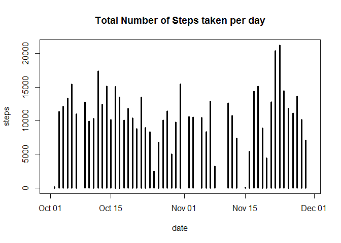
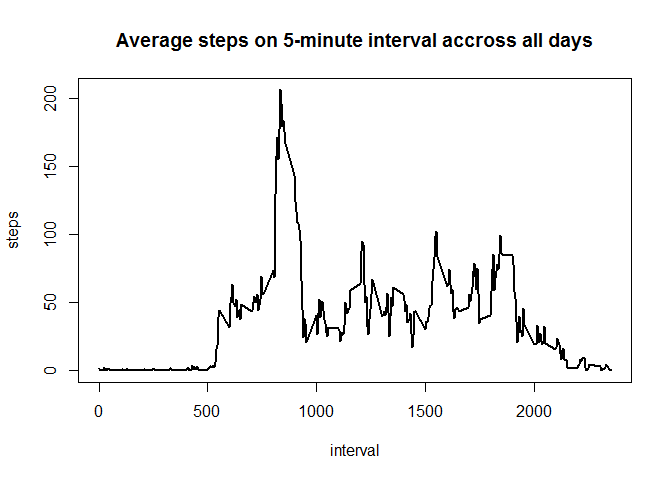
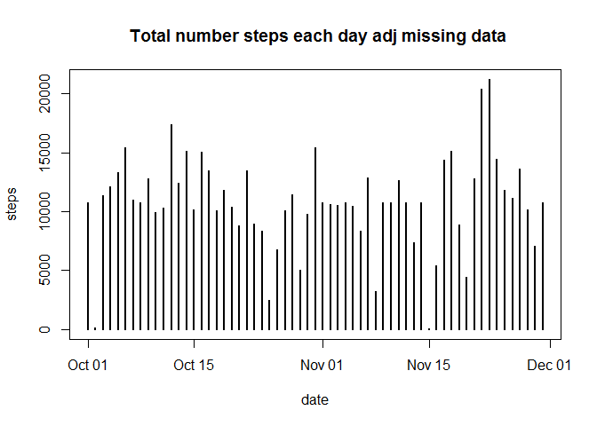
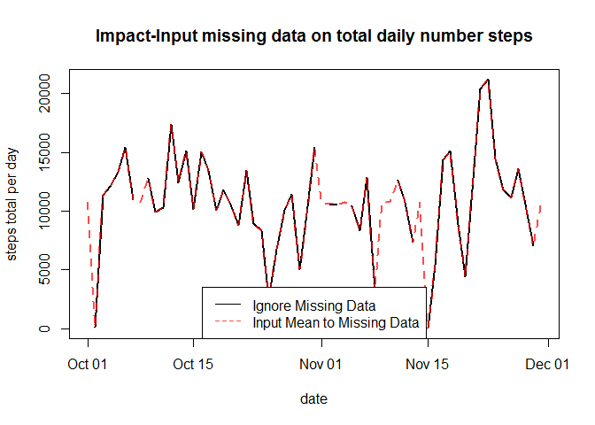
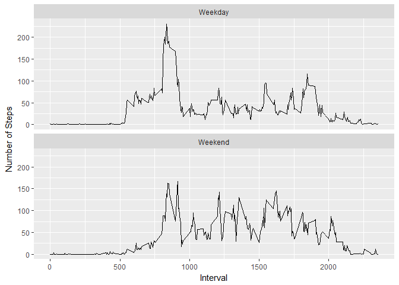

# What is mean total number of steps taken per day?
download, unzip & import


```r
download.file("https://d396qusza40orc.cloudfront.net/repdata%2Fdata%2Factivity.zip", destfile="C:/Users/HP/Documents/reproductiveResearch/activity.zip")

library(plyr)
zipF <- list.files(path="C:/Users/HP/Documents/reproductiveResearch", pattern = "*.zip", full.names = TRUE)
ldply(.data = zipF, .fun=unzip, exdir = "C:/Users/HP/Documents/reproductiveResearch")
```

```
##                                                        V1
## 1 C:/Users/HP/Documents/reproductiveResearch/activity.csv
```

```r
activity <- read.csv("C:/Users/HP/Documents/reproductiveResearch/activity.csv")
```

#Calculate the total number of steps taken per day - ignore missing data

```r
library(lubridate)
```

```
## 
## Attaching package: 'lubridate'
```

```
## The following object is masked from 'package:plyr':
## 
##     here
```

```
## The following object is masked from 'package:base':
## 
##     date
```

```r
activity$date <- ymd(activity$date)
data1 <- aggregate(activity$steps, by=list(date=activity$date), FUN=sum, na.rm=FALSE)
```

Make a histogram of the total number of steps taken each day

```r
plot(data1, ylab="steps", type="h", lwd=3, main="Total Number of Steps taken per day")
```

<!-- -->

Calculate and report the mean and median of the total number of steps taken per day

```r
library(dplyr)
```

```
## 
## Attaching package: 'dplyr'
```

```
## The following objects are masked from 'package:lubridate':
## 
##     intersect, setdiff, union
```

```
## The following objects are masked from 'package:plyr':
## 
##     arrange, count, desc, failwith, id, mutate, rename, summarise,
##     summarize
```

```
## The following objects are masked from 'package:stats':
## 
##     filter, lag
```

```
## The following objects are masked from 'package:base':
## 
##     intersect, setdiff, setequal, union
```

```r
data2 <- aggregate(activity$steps, by=list(date=activity$date), FUN=mean, na.rm=FALSE)
temp <- c("date", "mean-number-of-steps-per-day")
colnames(data2) <- temp
print(data2)
```

```
##          date mean-number-of-steps-per-day
## 1  2012-10-01                           NA
## 2  2012-10-02                    0.4375000
## 3  2012-10-03                   39.4166667
## 4  2012-10-04                   42.0694444
## 5  2012-10-05                   46.1597222
## 6  2012-10-06                   53.5416667
## 7  2012-10-07                   38.2465278
## 8  2012-10-08                           NA
## 9  2012-10-09                   44.4826389
## 10 2012-10-10                   34.3750000
## 11 2012-10-11                   35.7777778
## 12 2012-10-12                   60.3541667
## 13 2012-10-13                   43.1458333
## 14 2012-10-14                   52.4236111
## 15 2012-10-15                   35.2048611
## 16 2012-10-16                   52.3750000
## 17 2012-10-17                   46.7083333
## 18 2012-10-18                   34.9166667
## 19 2012-10-19                   41.0729167
## 20 2012-10-20                   36.0937500
## 21 2012-10-21                   30.6284722
## 22 2012-10-22                   46.7361111
## 23 2012-10-23                   30.9652778
## 24 2012-10-24                   29.0104167
## 25 2012-10-25                    8.6527778
## 26 2012-10-26                   23.5347222
## 27 2012-10-27                   35.1354167
## 28 2012-10-28                   39.7847222
## 29 2012-10-29                   17.4236111
## 30 2012-10-30                   34.0937500
## 31 2012-10-31                   53.5208333
## 32 2012-11-01                           NA
## 33 2012-11-02                   36.8055556
## 34 2012-11-03                   36.7048611
## 35 2012-11-04                           NA
## 36 2012-11-05                   36.2465278
## 37 2012-11-06                   28.9375000
## 38 2012-11-07                   44.7326389
## 39 2012-11-08                   11.1770833
## 40 2012-11-09                           NA
## 41 2012-11-10                           NA
## 42 2012-11-11                   43.7777778
## 43 2012-11-12                   37.3784722
## 44 2012-11-13                   25.4722222
## 45 2012-11-14                           NA
## 46 2012-11-15                    0.1423611
## 47 2012-11-16                   18.8923611
## 48 2012-11-17                   49.7881944
## 49 2012-11-18                   52.4652778
## 50 2012-11-19                   30.6979167
## 51 2012-11-20                   15.5277778
## 52 2012-11-21                   44.3993056
## 53 2012-11-22                   70.9270833
## 54 2012-11-23                   73.5902778
## 55 2012-11-24                   50.2708333
## 56 2012-11-25                   41.0902778
## 57 2012-11-26                   38.7569444
## 58 2012-11-27                   47.3819444
## 59 2012-11-28                   35.3576389
## 60 2012-11-29                   24.4687500
## 61 2012-11-30                           NA
```

```r
data3 <- aggregate(activity$steps, by=list(date=activity$date), FUN=median, na.rm=FALSE)
temp <- c("date", "median-number-of-steps-per-day")
colnames(data3) <- temp
print(data3)
```

```
##          date median-number-of-steps-per-day
## 1  2012-10-01                             NA
## 2  2012-10-02                              0
## 3  2012-10-03                              0
## 4  2012-10-04                              0
## 5  2012-10-05                              0
## 6  2012-10-06                              0
## 7  2012-10-07                              0
## 8  2012-10-08                             NA
## 9  2012-10-09                              0
## 10 2012-10-10                              0
## 11 2012-10-11                              0
## 12 2012-10-12                              0
## 13 2012-10-13                              0
## 14 2012-10-14                              0
## 15 2012-10-15                              0
## 16 2012-10-16                              0
## 17 2012-10-17                              0
## 18 2012-10-18                              0
## 19 2012-10-19                              0
## 20 2012-10-20                              0
## 21 2012-10-21                              0
## 22 2012-10-22                              0
## 23 2012-10-23                              0
## 24 2012-10-24                              0
## 25 2012-10-25                              0
## 26 2012-10-26                              0
## 27 2012-10-27                              0
## 28 2012-10-28                              0
## 29 2012-10-29                              0
## 30 2012-10-30                              0
## 31 2012-10-31                              0
## 32 2012-11-01                             NA
## 33 2012-11-02                              0
## 34 2012-11-03                              0
## 35 2012-11-04                             NA
## 36 2012-11-05                              0
## 37 2012-11-06                              0
## 38 2012-11-07                              0
## 39 2012-11-08                              0
## 40 2012-11-09                             NA
## 41 2012-11-10                             NA
## 42 2012-11-11                              0
## 43 2012-11-12                              0
## 44 2012-11-13                              0
## 45 2012-11-14                             NA
## 46 2012-11-15                              0
## 47 2012-11-16                              0
## 48 2012-11-17                              0
## 49 2012-11-18                              0
## 50 2012-11-19                              0
## 51 2012-11-20                              0
## 52 2012-11-21                              0
## 53 2012-11-22                              0
## 54 2012-11-23                              0
## 55 2012-11-24                              0
## 56 2012-11-25                              0
## 57 2012-11-26                              0
## 58 2012-11-27                              0
## 59 2012-11-28                              0
## 60 2012-11-29                              0
## 61 2012-11-30                             NA
```

What is the average daily activity pattern?

Make a time series plot (i.e. type = "l") of the 5-minute interval (x-axis) 
and the average number of steps taken, averaged across all days (y-axis)

```r
data4 <- aggregate(steps ~ interval, data=activity, mean)
plot(data4, type="l", lwd=2, main="Average steps on 5-minute interval accross all days")
```

<!-- -->

Which 5-minute interval, on average across all the days in the dataset, 
the maximum number of steps?

```r
temp <- subset(data4, steps==max(data4$steps))
temp$interval
```

```
## [1] 835
```

# Imputing missing values

Calculate and report the total number of rows with NAs

```r
good <- complete.cases(activity)
sum(good==F)
```

```
## [1] 2304
```

# Filling in all of the missing values in the dataset 
with the mean for that 5-minute interval, new dataset generated

```r
library(dplyr)
y <- data.frame()
i=1
for (i in 1:288){
        data4_steps <- data4$steps[i]
        data4_interval<- data4$interval[i]
        
        x <- filter(activity, activity$interval==data4_interval)
        x[is.na(x)] <- data4_steps
        y <- rbind(x, y)
}

y <- y[order(y$date, y$interval),]
```

histogram of the total number of steps taken each day on new dataset

```r
library(lubridate)
y$date <- ymd(y$date)

data5 <- aggregate(steps ~ date, data=y, sum)
plot(data5, type="h", lwd=2, main=" Total number steps each day adj missing data")
```

<!-- -->

mean & median total number of steps taken each day

```r
aggregate(steps ~ date, data=y, mean)
```

```
##          date      steps
## 1  2012-10-01 37.3825996
## 2  2012-10-02  0.4375000
## 3  2012-10-03 39.4166667
## 4  2012-10-04 42.0694444
## 5  2012-10-05 46.1597222
## 6  2012-10-06 53.5416667
## 7  2012-10-07 38.2465278
## 8  2012-10-08 37.3825996
## 9  2012-10-09 44.4826389
## 10 2012-10-10 34.3750000
## 11 2012-10-11 35.7777778
## 12 2012-10-12 60.3541667
## 13 2012-10-13 43.1458333
## 14 2012-10-14 52.4236111
## 15 2012-10-15 35.2048611
## 16 2012-10-16 52.3750000
## 17 2012-10-17 46.7083333
## 18 2012-10-18 34.9166667
## 19 2012-10-19 41.0729167
## 20 2012-10-20 36.0937500
## 21 2012-10-21 30.6284722
## 22 2012-10-22 46.7361111
## 23 2012-10-23 30.9652778
## 24 2012-10-24 29.0104167
## 25 2012-10-25  8.6527778
## 26 2012-10-26 23.5347222
## 27 2012-10-27 35.1354167
## 28 2012-10-28 39.7847222
## 29 2012-10-29 17.4236111
## 30 2012-10-30 34.0937500
## 31 2012-10-31 53.5208333
## 32 2012-11-01 37.3825996
## 33 2012-11-02 36.8055556
## 34 2012-11-03 36.7048611
## 35 2012-11-04 37.3825996
## 36 2012-11-05 36.2465278
## 37 2012-11-06 28.9375000
## 38 2012-11-07 44.7326389
## 39 2012-11-08 11.1770833
## 40 2012-11-09 37.3825996
## 41 2012-11-10 37.3825996
## 42 2012-11-11 43.7777778
## 43 2012-11-12 37.3784722
## 44 2012-11-13 25.4722222
## 45 2012-11-14 37.3825996
## 46 2012-11-15  0.1423611
## 47 2012-11-16 18.8923611
## 48 2012-11-17 49.7881944
## 49 2012-11-18 52.4652778
## 50 2012-11-19 30.6979167
## 51 2012-11-20 15.5277778
## 52 2012-11-21 44.3993056
## 53 2012-11-22 70.9270833
## 54 2012-11-23 73.5902778
## 55 2012-11-24 50.2708333
## 56 2012-11-25 41.0902778
## 57 2012-11-26 38.7569444
## 58 2012-11-27 47.3819444
## 59 2012-11-28 35.3576389
## 60 2012-11-29 24.4687500
## 61 2012-11-30 37.3825996
```

```r
aggregate(steps ~ date, data=y, median)
```

```
##          date    steps
## 1  2012-10-01 34.11321
## 2  2012-10-02  0.00000
## 3  2012-10-03  0.00000
## 4  2012-10-04  0.00000
## 5  2012-10-05  0.00000
## 6  2012-10-06  0.00000
## 7  2012-10-07  0.00000
## 8  2012-10-08 34.11321
## 9  2012-10-09  0.00000
## 10 2012-10-10  0.00000
## 11 2012-10-11  0.00000
## 12 2012-10-12  0.00000
## 13 2012-10-13  0.00000
## 14 2012-10-14  0.00000
## 15 2012-10-15  0.00000
## 16 2012-10-16  0.00000
## 17 2012-10-17  0.00000
## 18 2012-10-18  0.00000
## 19 2012-10-19  0.00000
## 20 2012-10-20  0.00000
## 21 2012-10-21  0.00000
## 22 2012-10-22  0.00000
## 23 2012-10-23  0.00000
## 24 2012-10-24  0.00000
## 25 2012-10-25  0.00000
## 26 2012-10-26  0.00000
## 27 2012-10-27  0.00000
## 28 2012-10-28  0.00000
## 29 2012-10-29  0.00000
## 30 2012-10-30  0.00000
## 31 2012-10-31  0.00000
## 32 2012-11-01 34.11321
## 33 2012-11-02  0.00000
## 34 2012-11-03  0.00000
## 35 2012-11-04 34.11321
## 36 2012-11-05  0.00000
## 37 2012-11-06  0.00000
## 38 2012-11-07  0.00000
## 39 2012-11-08  0.00000
## 40 2012-11-09 34.11321
## 41 2012-11-10 34.11321
## 42 2012-11-11  0.00000
## 43 2012-11-12  0.00000
## 44 2012-11-13  0.00000
## 45 2012-11-14 34.11321
## 46 2012-11-15  0.00000
## 47 2012-11-16  0.00000
## 48 2012-11-17  0.00000
## 49 2012-11-18  0.00000
## 50 2012-11-19  0.00000
## 51 2012-11-20  0.00000
## 52 2012-11-21  0.00000
## 53 2012-11-22  0.00000
## 54 2012-11-23  0.00000
## 55 2012-11-24  0.00000
## 56 2012-11-25  0.00000
## 57 2012-11-26  0.00000
## 58 2012-11-27  0.00000
## 59 2012-11-28  0.00000
## 60 2012-11-29  0.00000
## 61 2012-11-30 34.11321
```

#What is the impact of imputing missing data on the estimates of the total daily number of steps?

```r
data7 <- cbind(data1,data5)
data7 <- data7[,-3]
temp <- c("date","steps.with.NAs", "steps.adj")
colnames(data7) <- temp

with(data7, plot(date, steps.with.NAs, type="l", lwd=2, ylab="steps total per day",
                 main="Impact-Input missing data on total daily number steps"))

with(data7, lines(date, steps.adj, lty=2, lwd=2, col=rgb(1, 0, 0, .7)))

legend("bottom", c("Ignore Missing Data", "Input Mean to Missing Data"), lty=c(1,2),
       col=c("black",rgb(1, 0, 0, .7)))
```

<!-- -->

# Are there differences in activity patterns between weekdays and weekends?
Create a new factor variable in the dataset with two levels - "weekday" and "weekend"

```r
library(dplyr)
y <- mutate(y, newvar = weekdays(date))

weekday <- c("Monday", "Tuesday", "Wednesday", "Thursday", "Friday")

y$newvar <- factor((y$newvar %in% weekday), levels=c(TRUE, FALSE),
                   labels=c("weekday", "weekend"))
str(y$newvar)
```

```
##  Factor w/ 2 levels "weekday","weekend": 1 1 1 1 1 1 1 1 1 1 ...
```

Make a panel plot containing a time series plot (i.e. type = "l") of the 5-minute interval (x-axis)
and the average number of steps taken, averaged across all weekday days or weekend days (y-axis). 


```r
y1 <- y
y1$newvar <- as.character(y1$newvar)

y1 <- aggregate(y1$steps, by=list(y1$interval, y$newvar), FUN=mean)

labels=c("weekday"="Weekday","weekend"="Weekend")

library(ggplot2)
g <- ggplot(y1, aes(Group.1, x))
g + geom_line() + 
        facet_wrap( ~Group.2, ncol=1, labeller=labeller(Group.2=labels)) +
        xlab("Interval") + ylab("Number of Steps")
```

<!-- -->


